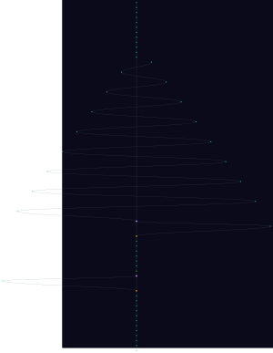

# wine-gaming

<!-- Project Shields/Badges -->
<p align="center">
  <a href="https://github.com/xaoscience/wine-gaming">
    
  </a>
  <a href="https://github.com/xaoscience/wine-gaming/releases">
    
  </a>
  <a href="https://github.com/xaoscience/wine-gaming/blob/main/LICENSE">
    
  </a>
</p>

<p align="center">
  <a href="https://github.com/xaoscience/wine-gaming/actions">
    
  </a>
  <a href="https://github.com/xaoscience/wine-gaming/issues">
    
  </a>
  <a href="https://github.com/xaoscience/wine-gaming/pulls">
    
  </a>
  <a href="https://github.com/xaoscience/wine-gaming/stargazers">
    
  </a>
  <a href="https://github.com/xaoscience/wine-gaming/network/members">
    
  </a>
</p>

<p align="center">
  
  
  
  
</p>

<!-- Optional: Stability/Maturity Badge -->
<p align="center">
  
  
</p>

---

# Wine Proton Multi-Launcher Setup Script

Centralized bash script to manage multiple game launchers (EA Desktop, GOG Galaxy, Epic Games, Ubisoft Connect, Amazon Games, Legacy Games) in a single Wine Proton prefix on Linux.

**Features:**
- ✅ Automatic installer detection and downloading with caching
- ✅ Install/uninstall/launch launchers via single command
- ✅ Desktop shortcut creation for launchers
- ✅ Batch operations (install-all, list status)
- ✅ Wine prefix management (init, backup, restore, purge)
- ✅ Z: drive mount control (for disk space reporting fixes)
- ✅ Comprehensive robustness libraries (Lutris/Heroic compatible)
- ✅ GPU acceleration optimised (NVIDIA RTX tested)

## Quick Start

### Prerequisites
```bash
# Ubuntu/Debian
sudo apt install wine winetricks wget
cd ~/PRO/SYS/WINE/wine-gaming

# OR use your existing path
cd /path/to/wine-gaming
```

### First-Time Setup
```bash
# 1. Install Proton-GE (one time only)
./setup install-proton

# 2. Initialise Wine prefix with dependencies
./setup init

# 3. Install all launchers
./setup install-all

# 4. List installed apps
./setup list
```

### Daily Usage
```bash
# Launch a launcher
./setup launch gog-galaxy
./setup launch epic-games

# Check status
./setup list

# Install a specific launcher
./setup install ea-desktop
```

## Commands

### Wine Prefix Management
```bash
./setup purge                       # Delete prefix, start fresh
./setup init                        # Initialise with dependencies
./setup full                        # Complete setup: purge + init + install-all
./setup quick                       # Quick: reinit deps + install remaining apps
./setup backup                      # Backup DLLs and packages
./setup restore                     # Restore from backup
./setup install-proton              # Install Proton-GE
```

### Z: Drive Management (Disk Space Fixes)
```bash
./setup unmount-z                   # Hide Z: drive (fixes EA Desktop disk space warnings)
./setup mount-z                     # Restore Z: drive
./setup suppress-z-warnings         # Mute Z: drive error logs
./setup fix-z-drive                 # Permanently remove Z: drive
./setup configure-drives D /path    # Create custom drive letter (e.g., D: → /mnt/DATA-NVME)
```

### App Management
```bash
./setup list                        # Show all launchers and install status
./setup list-installers             # Show available installers in ./installers/
./setup install <app-key>           # Install launcher
./setup install <app-key> <path>    # Install with custom installer path
./setup install-all                 # Install all registered launchers
./setup uninstall <app-key>         # Uninstall launcher
./setup launch <app-key>            # Launch installed app
./setup launch-exe /path/Game.exe   # Launch external .exe/.msi in managed prefix
./setup prefix-info                 # Show exact prefix/env values used by this toolset
```

### Desktop Shortcuts
```bash
./setup install-shortcut <app-key>  # Create .desktop file
./setup remove-shortcut <app-key>   # Remove shortcut
```

## Available Launchers

```
ea-desktop        → EA Desktop (Origin)
gog-galaxy        → GOG Galaxy
epic-games        → Epic Games Launcher
ubisoft-connect   → Ubisoft Connect
amazon-games      → Amazon Games
legacy-games      → Legacy Games
```

## Common Workflows

### Use The Managed `~/.wine-gaming` Prefix Outside The Script
```bash
# Show exact environment values used by this project
./setup prefix-info

# Reuse the same managed prefix for manual Wine commands
export WINE_DIR="$HOME/.wine-gaming"
export STEAM_COMPAT_DATA_PATH="$WINE_DIR/prefix"
export WINEPREFIX="$WINE_DIR/prefix/pfx"

# Example manual launch (if needed)
wine /absolute/path/to/Game.exe
```

This prevents fallback to host defaults like `~/.wine` or accidental ad-hoc prefixes.

### Launch Any External Game EXE (Not In App Registry)
```bash
# Runs through this project's managed Proton/Wine runtime
./setup launch-exe /absolute/path/to/Game.exe

# MSI installers are also supported
./setup launch-exe /absolute/path/to/Installer.msi
```

### Fresh Installation
```bash
./setup install-proton
./setup full                        # Purge + init + install-all
./setup list
```

### Add New Launcher to Existing Setup
```bash
./setup quick                       # Reinit, preserve existing, install missing
```

### Fix Disk Space Issues (EA Desktop, etc)
```bash
./setup unmount-z                   # Hide /mnt volumes from Wine
# Run EA Desktop's verification
./setup mount-z                     # Restore Z: drive when done
```

### Download Installers Locally
1. Download from INSTALLER_LINKS.md to `./installers/`
2. Run: `./setup install <app-key>`
3. Script prefers local installers over downloads

## Configuration

### Edit App Registry
Edit the `APP_REGISTRY` array in the `setup` script to add/modify launchers:

```bash
declare -A APP_REGISTRY=(
    [my-launcher]="Display Name|Program Files/Path/app.exe|https://download.url|uninstall-path1|uninstall-path2"
)
```

Format: `[key]="Name|ExePath|DownloadURL|UninstallPath1|UninstallPath2|..."`

### Change Wine/Proton Version
Edit at top of script:
```bash
WINE_DIR="${HOME}/.wine-gaming"          # Wine prefix location
PROTON_DIR="${WINE_DIR}/proton-ge"       # Proton executable
PROTON_VERSION="GE-Proton9-18"           # Version (in install_proton function)
```

## Directories

```
~/.wine-gaming/
├── prefix/pfx/              # Wine prefix (Windows filesystem)
├── proton-ge/               # Proton executable
├── bin/                     # Generated launcher scripts
└── backup/                  # Backup DLLs/packages

~/.cache/wine-installers/    # Downloaded installers (cached)
~/.local/share/applications/ # Desktop shortcuts
```

## Troubleshooting

### Launcher won't install
```bash
# Check if Proton is installed
ls ~/.wine-gaming/proton-ge/proton

# Manually download installer to ./installers/
./setup install <app-key> ./installers/Installer.exe

# Check logs
cat ~/.wine-gaming/proton.log | tail -50
```

### Launcher won't launch
```bash
# Check if app is installed
./setup list

# Try launching with verbose output
PROTON_LOG=1 PROTON_LOG_DIR=~/.wine-gaming ./setup launch <app-key>

# Check Proton logs
cat ~/.wine-gaming/proton.log | tail -100
```

### Disk space warnings in EA Desktop / GOG Galaxy
```bash
# Unmount Z: drive (prevents Wine from seeing /mnt)
./setup unmount-z

# Run EA Desktop's verification/repair
# Then restore Z: when done
./setup mount-z
```

### GOG Galaxy update fails at 0KB
```bash
# Issue: Z: drive permission errors on mount points
./setup suppress-z-warnings          # Mute warnings
./setup unmount-z                    # Hide /mnt from Wine
# Try update again
./setup mount-z                      # Restore when done
```

### Wine prefix corrupted
```bash
# Backup first (if you have anything important)
./setup backup

# Full reset
./setup purge
./setup full

# Restore if needed
./setup restore
```

## Wine Robustness Libraries

The script installs comprehensive dependencies used by Lutris and Heroic:

- **Graphics**: d3dcompiler, d3dx9-11, dxvk, vkd3d, d9vk
- **Audio**: directmusic, faudio, xact, directplay, directshow
- **System**: vcrun*, dotnet*, corefonts, gdiplus, physx, msctf
- **GPU**: Optimised for NVIDIA RTX (DXVK, shader cache enabled)

See `init()` function for full library list.

## Performance Tuning

### GPU Optimisation (for launchers with embedded browsers)
Edit `launch_app()` function to adjust:
```bash
export __GL_SHADER_DISK_CACHE=1              # Improve framerate
export __GL_THREADED_OPTIMIZATION=1          # Multi-threaded rendering
export DXVK_HUD=0                            # Hide DXVK overlay
```

### CPU Optimisation
```bash
# For faster winetricks installation, add to ~/.bashrc:
export WINETRICKS_DOWNLOAD_TIMEOUT=60
export WINETRICKS_DOWNLOADER=wget
```

## Advanced Topics

### Custom Drive Mappings
```bash
# Map /mnt/DATA-NVME as D: drive
./setup configure-drives D /mnt/DATA-NVME

# List current mappings
ls -la ~/.wine-gaming/prefix/pfx/dosdevices/
```

### Run Wine Commands Directly
```bash
export WINEPREFIX=~/.wine-gaming/prefix/pfx
wine cmd.exe /c dir c:\\

# Or use script's environment:
WINEPREFIX=~/.wine-gaming/prefix/pfx wine reg query "HKEY_CURRENT_USER\Software\Wine\Direct3D"
```

### Check Installed Apps
```bash
find ~/.wine-gaming/prefix/pfx/drive_c/Program\ Files -name "*.exe" -type f | head -20
```

## Contributing

Want to add another launcher? 

1. Add entry to `APP_REGISTRY` at top of script
2. Ensure installer URL is direct-downloadable via wget
3. Test: `./setup install <your-key>`
4. Verify: `./setup launch <your-key>`

## Issues & Limitations

- ⚠️ **Wine drive letters in file dialogues**: Custom drive letters (D:, E:) don't always show in Proton app dialogues; Z: at "/" is Wine standard behaviour
- ⚠️ **Z: drive warnings**: "Read access denied" errors are harmless; use `suppress-z-warnings` to mute
- ✅ **GPU acceleration**: Tested on NVIDIA RTX 2060+ (DXVK v2.4.1)
- ✅ **Disk space reporting**: Use `unmount-z` before EA Desktop's disk checks

## Licence

GPL-3 - Free to use and modify

## Changelog

### v1.0 (Nov 2025)
- ✅ Initial release with 6 launchers
- ✅ Automatic installer detection
- ✅ Z: drive mount/unmount management
- ✅ Comprehensive robustness libraries (Lutris-compatible)
- ✅ GPU acceleration optimised

See git history for full changelog.

<!-- TREE-VIZ-START -->



[Full SVG](../.github/tree-viz/git-tree.svg) · [Interactive version](../.github/tree-viz/git-tree.html) · [View data](../.github/tree-viz/git-tree-data.json)

<!-- TREE-VIZ-END -->
